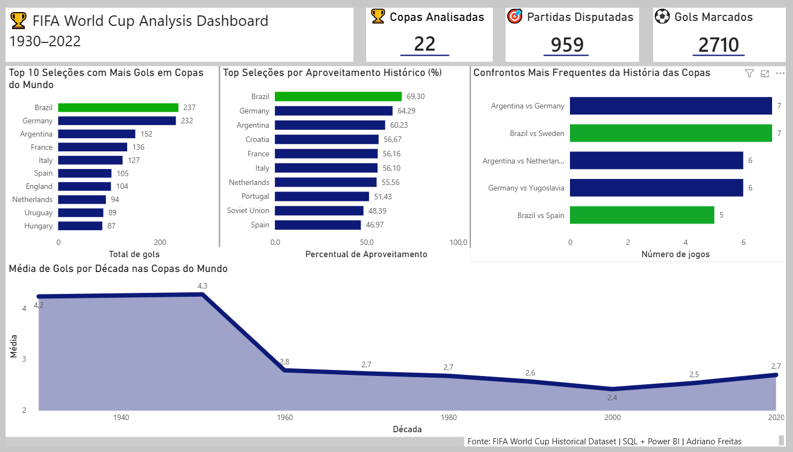

# 🏆 FIFA World Cup Analysis Dashboard (1930–2022)

Projeto de análise histórica das Copas do Mundo FIFA utilizando **SQL, Power BI, Git e GitHub**.

## 📌 Objetivo

O objetivo deste projeto foi praticar conceitos de análise de dados por meio da exploração de informações históricas das Copas do Mundo FIFA entre 1930 e 2022.

Durante o desenvolvimento foram aplicadas etapas de:

* Limpeza e tratamento de dados
* Padronização de informações históricas
* Análise exploratória
* Construção de métricas e indicadores
* Desenvolvimento de dashboard no Power BI
* Versionamento com Git e GitHub

---

## 🛠️ Ferramentas Utilizadas

* SQL (MySQL)
* Power BI
* Git
* GitHub

---

## 📂 Estrutura do Projeto

```text
world-cup-analysis
│
├── dataset/
│   └── matches.csv
│
├── sql/
│   ├── 01.matches_man.sql
│   ├── 02.matches_man_clear_exploracao.sql
│   ├── 03.top_selecoes_com_mais_vitorias.sql
│   ├── 04.top_gols_selecoes.sql
│   ├── 05.saldo_gols.sql
│   ├── 06.maiores_confrontos.sql
│   └── 07.media_gols_decada.sql
│
├── resultados/
│   ├── aproveitamento_selecoes.csv
│   ├── maiores_confrontos.csv
│   ├── media_gols_copas.csv
│   ├── media_gols_decadas.csv
│   └── top_gols_selecoes.csv
│
└── README.md
```

---

## 📊 Dashboard

```markdown

```

---

## 🔍 Principais Análises

### ⚽ Top 10 Seleções com Mais Gols

Identificação das seleções mais ofensivas da história das Copas do Mundo.

### 📈 Aproveitamento Histórico das Seleções

Comparação do percentual de vitórias entre as principais seleções participantes.

### 🤝 Confrontos Mais Frequentes

Levantamento dos confrontos que mais se repetiram ao longo da história do torneio.

### 📉 Evolução da Média de Gols por Década

Análise da evolução do comportamento ofensivo das Copas do Mundo ao longo do tempo.

---

## 💡 Principais Insights

* Foram analisadas 22 edições da Copa do Mundo FIFA.
* O dataset contém 959 partidas disputadas.
* Foram registrados 2710 gols ao longo da história do torneio.
* O Brasil lidera em número total de gols marcados.
* O Brasil também apresenta o maior aproveitamento histórico entre as seleções analisadas.
* Brasil x Suécia e Argentina x Alemanha figuram entre os confrontos mais recorrentes.
* A média de gols por partida era superior a 4 gols nas primeiras décadas do torneio.
* Houve uma redução significativa da média de gols após a década de 1950, seguida por uma leve recuperação nos anos mais recentes.

---

## 👨‍💻 Autor

**Adriano Freitas**

Projeto desenvolvido com foco em aprendizado e construção de portfólio na área de Dados.
